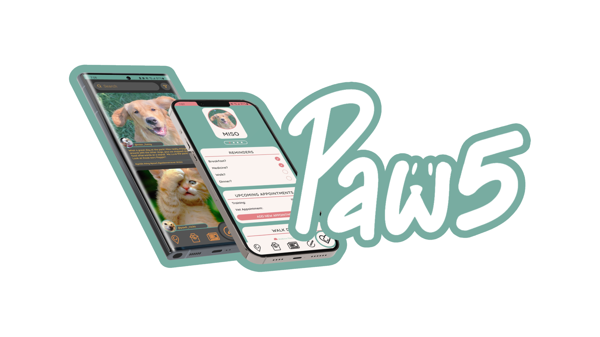

  
  
  

     
    <a href="https://github.com/Paw5/frontend"><strong>Check out our FRONTEND! »</strong></a>
     
     
    <a href="https://github.com/Paw5/backend"><strong>Check out our BACKEND! »</strong></a>
  

  
Table of Contents

  <ol>
    <li>
      <a href="#about-the-project">About The Project</a>
      <ul>
        <li><a href="#tools">Tools</a></li>
      </ul>
    </li>
    <li><a href="#usage">Usage and Installation</a></li>
    <li><a href="#contributors">Contributors</a></li>
  </ol>

## About The Project
Paw5 is an app that helps organize all facets of pet ownership neatly into five categories: Health, Map, Community, Services and News. With the app, users will be able to monitor their pets and delve into the pet community around them. From boarding during travel, finding pet-friendly places to hang out, or even updating your neighbors and friends on information about your pets, Paw5 aims to be the go-to pet app on every pet lovers phone!
 
 
### Built With
* [![JS]][JSurl]
* [![TypeScript]][TSurl]
* [![Nodejs]][Nodejsurl]
* [![RNative]][RNurl]
* [![MySQL]][MySQLurl]
* [![AWS]][AWSurl]
* [![Postman]][Postmanurl]
* [![Expo]][Expourl]
* [![ESLint]][ESurl]
* [![Jest]][Jesturl]
* [![VS]][VSurl]
* [![PS]][PSurl]

(<a href="#top">back to top</a>)

## Usage
To be added.
 

(<a href="#top">back to top</a>)

## Contributors

### Cody Hogan 
* [![LinkedIn]][LinkedInCody]
* [![Github]][GithubCody]

### Grae Horton 
* [![LinkedIn]][LinkedInGrae]
* [![Github]][GithubGrae]

### Joshua Thomas
* [![LinkedIn]][LinkedInJosh]
* [![Github]][GithubJosh]

### Noah Johnson
* [![LinkedIn]][LinkedInNoah]
* [![Github]][GithubNoah]

(<a href="#top">back to top</a>)

[LinkedIn]: https://img.shields.io/badge/LinkedIn-0077B5?style=for-the-badge&logo=linkedin&logoColor=white
[Github]: https://img.shields.io/badge/GitHub-100000?style=for-the-badge&logo=github&logoColor=white
[LinkedInCody]: https://www.linkedin.com/in/codyqhogan/
[GithubCody]: https://github.com/codyqhogan
[LinkedInGrae]: https://www.linkedin.com/in/graehorton/
[GithubGrae]: https://github.com/kgh0054
[LinkedInNoah]: https://www.linkedin.com/in/noah-johnson-786455167/
[GithubNoah]: https://github.com/johnsnoa
[LinkedInJosh]: https://www.linkedin.com/in/joshuamathewthomas/
[GithubJosh]: https://github.com/KaptainJosh
[JS]: https://img.shields.io/badge/JavaScript-323330?style=for-the-badge&logo=javascript&logoColor=F7DF1E
[JSurl]: https://www.javascript.com/
[PS]: https://img.shields.io/badge/Adobe%20Photoshop-31A8FF?style=for-the-badge&logo=Adobe%20Photoshop&logoColor=black
[PSurl]: https://www.adobe.com/products/photoshop/landpa.html?sdid=KKQIN&mv=search&kw=photoshop&ef_id=Cj0KCQjwuaiXBhCCARIsAKZLt3kAIUDI8pHVI7aOMDhje43QN6h3HbJVwG3crWMH70Ihh7zIBdWU8lEaAtz_EALw_wcB:G:s&s_kwcid=AL!3085!3!522504775617!e!!g!!photoshop!1712238394!67643541820&gclid=Cj0KCQjwuaiXBhCCARIsAKZLt3kAIUDI8pHVI7aOMDhje43QN6h3HbJVwG3crWMH70Ihh7zIBdWU8lEaAtz_EALw_wcB
[VS]: https://img.shields.io/badge/Visual_Studio_Code-0078D4?style=for-the-badge&logo=visual%20studio%20code&logoColor=white
[VSurl]: https://code.visualstudio.com/
[RNative]: https://img.shields.io/badge/React_Native-20232A?style=for-the-badge&logo=react&logoColor=61DAFB
[RNurl]: https://reactnative.dev/
[AWS]: https://img.shields.io/badge/Amazon_AWS-232F3E?style=for-the-badge&logo=amazon-aws&logoColor=white
[AWSurl]: https://aws.amazon.com/
[Jest]: https://img.shields.io/badge/Jest-323330?style=for-the-badge&logo=Jest&logoColor=white
[Jesturl]: https://jestjs.io/
[Nodejs]: https://img.shields.io/badge/Node.js-43853D?style=for-the-badge&logo=node.js&logoColor=white
[Nodejsurl]: https://nodejs.org/en/
[MySQL]: https://img.shields.io/badge/MySQL-005C84?style=for-the-badge&logo=mysql&logoColor=white
[MySQLurl]: https://www.mysql.com/
[ESLint]: https://img.shields.io/badge/eslint-3A33D1?style=for-the-badge&logo=eslint&logoColor=white
[ESurl]: https://eslint.org/
[TypeScript]: https://img.shields.io/badge/TypeScript-007ACC?style=for-the-badge&logo=typescript&logoColor=white
[TSurl]: https://www.typescriptlang.org/
[Expo]: https://img.shields.io/badge/expo-1C1E24?style=for-the-badge&logo=expo&logoColor=#D04A37
[Expourl]: https://expo.dev/client
[Postman]: https://img.shields.io/badge/Postman-FF6C37?style=for-the-badge&logo=postman&logoColor=white
[Postmanurl]: https://www.postman.com/
